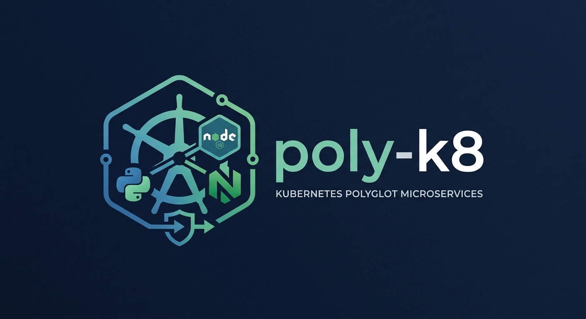
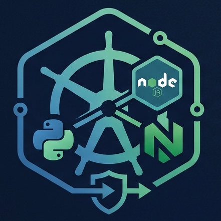

<p align="center">
  
</p>

<h1 align="center">poly-k8</h1>

<p align="center">
  <strong>Polyglot Microservices Mesh on Kubernetes</strong>
</p>

<p align="center">
  
  
  
  
</p>

<p align="center">
  
  
  
  
  
  
  
</p>

<p align="center">
  
</p>

---

Arquitectura de microservicios políglotas (Python, Node.js/TypeScript, Nginx) que interactúan entre sí en un clúster de Kubernetes.

## Arquitectura

```
[ Cliente / Navegador ]
          │
          ▼ (Puerto 80)
   [ Nginx Ingress ]
      │          │
      │          └─ / ──────────────────────► [frontend-svc] ────► [01-frontend] (Nginx Static)
      │
      └─ /api/ ─────────────────────────────► [api-gateway-svc] ─► [02-api-gateway] (TS/Express)
                                                   │
                        ┌──────────────────────────┼──────────────────────────┐
                        ▼                          ▼                          ▼
               [auth-svc:8080]            [analytics-svc:8080]       [processor-svc:8080]
              [03-auth-service]          [04-analytics-service]     [05-data-processor]
               (Python/FastAPI)             (Node.js/Express)          (Python/Flask)
```

## Microservicios

| Servicio | Tecnología | Puerto | Descripción |
|----------|------------|--------|-------------|
| `01-frontend` | Nginx Alpine | 80 | Interfaz web estática |
| `02-api-gateway` | TypeScript/Express | 3000 | Gateway central de API |
| `03-auth-service` | Python/FastAPI | 8080 | Servicio de autenticación |
| `04-analytics-service` | Node.js/Express | 8080 | Métricas y analytics |
| `05-data-processor` | Python/Flask | 8080 | Procesamiento de datos |

## Requisitos Previos

- Docker instalado y ejecutándose
- Kubernetes local (Minikube o Kind)
- kubectl configurado

## Inicio Rápido

### 1. Iniciar Minikube/Kind con Ingress habilitado

**Para Minikube:**
```bash
minikube start
minikube addons enable ingress
```

**Para Kind:**
```bash
kind create cluster --config kind-config.yaml
kubectl apply -f https://raw.githubusercontent.com/kubernetes/ingress-nginx/main/deploy/static/provider/kind/deploy.yaml
```

### 2. Construir y desplegar

```bash
chmod +x scripts/build-and-load.sh
./scripts/build-and-load.sh
```

### 3. Verificar el despliegue

```bash
# Ver pods
kubectl get pods -n poly-k8

# Ver servicios
kubectl get svc -n poly-k8

# Ver ingress
kubectl get ingress -n poly-k8
```

### 4. Acceder a la aplicación

```bash
# Obtener la URL del Ingress
minikube service list -n poly-k8

# O usar port-forward para pruebas
kubectl port-forward -n poly-k8 svc/frontend-svc 8080:80
kubectl port-forward -n poly-k8 svc/api-gateway-svc 3000:3000
```

## Endpoints Disponibles

- `GET /` → Frontend (dashboard web)
- `GET /api/health` → Health check del API Gateway
- `GET /api/auth/validate` → Validación de autenticación
- `GET /api/analytics` → Métricas del clúster
- `POST /api/process` → Procesamiento de datos

## Estructura del Proyecto

```
poly-k8/
├── microservices/
│   ├── 01-frontend/
│   ├── 02-api-gateway/
│   ├── 03-auth-service/
│   ├── 04-analytics-service/
│   └── 05-data-processor/
├── k8s/
│   ├── 00-namespace.yaml
│   ├── 01-configmap-secrets.yaml
│   ├── 02-deployments.yaml
│   ├── 03-services.yaml
│   └── 04-ingress.yaml
├── scripts/
│   └── build-and-load.sh
├── SDD.md
└── README.md
```

## Limpieza

```bash
kubectl delete namespace poly-k8
docker rmi poly-k8/frontend:v1 poly-k8/api-gateway:v1 poly-k8/auth-svc:v1 poly-k8/analytics-svc:v1 poly-k8/processor-svc:v1
```

---

<p align="center">
  
  
  
  
  
</p>

<p align="center">
  Built with ❤️ for Kubernetes
</p>
